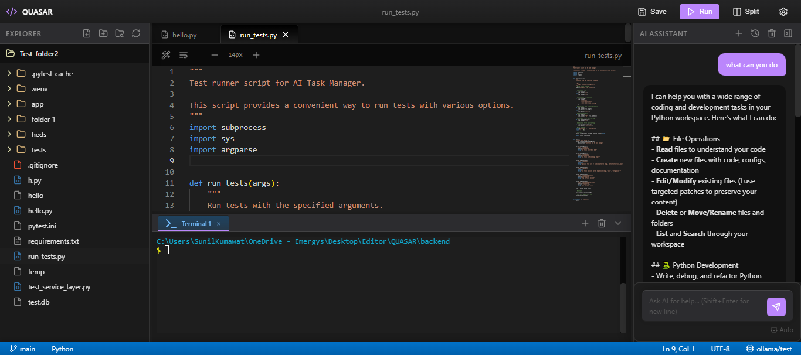
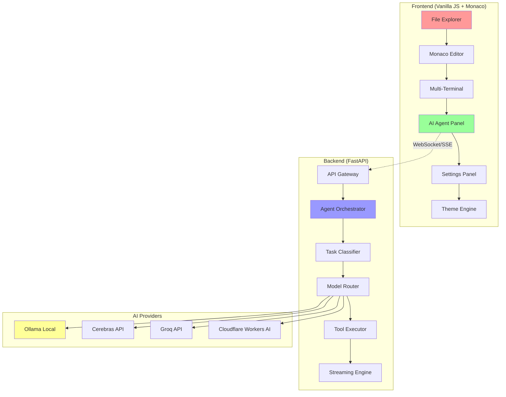
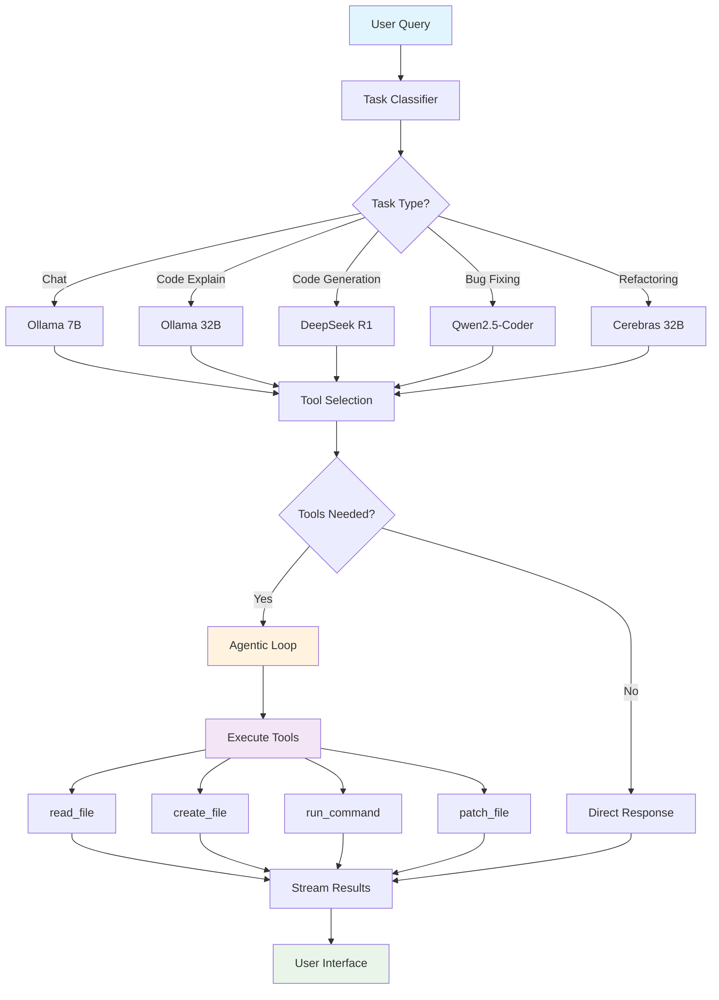
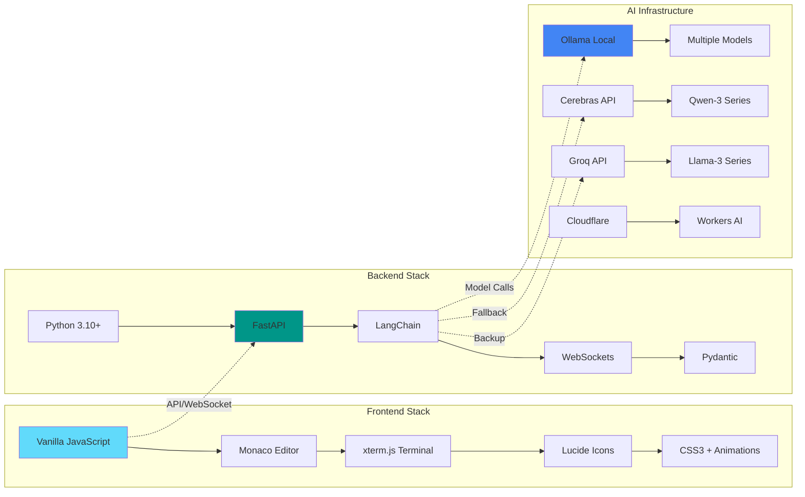

# 🌟 QUASAR - AI-Powered Code Editor

<div align="center">


**A next-generation AI-powered code editor with intelligent agent system and real-time streaming responses**

[✨ Features](#-features) • [🏗️ Architecture](#️-architecture) • [🚀 Quick Start](#-quick-start) • [📱 Demo](#-demo) • [🤝 Contributing](#-contributing)



</div>

---

## 🌟 Overview

QUASAR is a revolutionary AI-powered code editor that transforms how developers write, understand, and debug code. With its intelligent agent orchestrator, real-time streaming responses, and modern glassmorphism interface, QUASAR provides a seamless coding experience that feels like having an expert AI pair programmer by your side.

### 🎯 Key Highlights

- 🤖 **Intelligent AI Agent**: Multi-model orchestrator with task-specific routing
- ⚡ **Real-time Streaming**: See AI responses word-by-word as they generate
- � **Aoutonomous Tool Calling**: AI reads/writes files and executes commands independently
- � ***Modern Design**: Glassmorphism UI with smooth micro-animations
- 📝 **Monaco Editor**: Full VS Code editing experience in the browser
- 💻 **Multi-Terminal**: Tabbed terminal sessions with WebSocket connectivity
- 🔄 **Smart Fallbacks**: Automatic failover across multiple LLM providers
- 🌓 **Theme Engine**: Dark, Light, and Midnight OLED themes

---

## 🏗️ Architecture

### System Overview



### AI Agent Orchestration Flow



### Technology Stack



---

## ✨ Features

### 🎯 Core Functionality

| Feature | Description | Technology |
|---------|-------------|------------|
| **AI Agent Orchestrator** | Intelligent task classification and model routing | LangChain + Custom Logic |
| **Real-time Streaming** | Word-by-word AI response streaming | Server-Sent Events (SSE) |
| **Agentic Tool Calling** | AI autonomously uses tools to complete tasks | LangChain Tools + Custom Executors |
| **Multi-Model Support** | 10+ models across 4 providers with smart fallbacks | Ollama, Cerebras, Groq, Cloudflare |
| **File Management** | Full CRUD operations with real-time tree updates | FastAPI + WebSocket events |
| **Code Execution** | Run code directly in integrated terminal | WebSocket terminal + Process management |
| **Context Management** | Smart token budgeting and conversation history | Custom context manager |

### 🎨 Modern Interface

- **🌈 Glassmorphism Design**: Translucent panels with backdrop blur effects
- **🎭 Micro-animations**: Smooth transitions and hover effects throughout
- **🌓 Advanced Theming**: Dark, Light, and Midnight OLED themes with instant switching
- **📱 Responsive Layout**: Adaptive panels that work on all screen sizes
- **🎯 Intuitive Navigation**: Clear visual hierarchy and consistent interactions
- **💬 Interactive Feedback**: Toast notifications and progress indicators
- **⚙️ Centralized Settings**: One-click access to all customization options

### 🤖 AI Capabilities

- **📝 Code Generation**: Create functions, classes, and complete modules
- **🔍 Code Explanation**: Understand complex code with detailed breakdowns
- **🐛 Bug Fixing**: Automatically detect and fix errors with context
- **♻️ Refactoring**: Improve code quality following best practices
- **🧪 Test Generation**: Create comprehensive test suites
- **📚 Documentation**: Generate docstrings and README files
- **🏗️ Architecture Design**: Get system design recommendations
- **💬 Interactive Chat**: Natural conversation about your codebase

### 🛡️ Reliability Features

- **🔄 Multi-Provider Fallback**: Automatic switching between AI providers
- **🔑 Credential Rotation**: Multiple API keys per provider for higher limits
- **⚡ Smart Caching**: Context and response caching for better performance
- **🚦 Rate Limiting**: Built-in protection against API abuse
- **💾 Session Persistence**: Automatic saving of chat history and settings
- **🔒 Secure Processing**: All operations sandboxed within workspace
- **📊 Error Recovery**: Graceful handling of network and API failures

---

## 🚀 Quick Start

### Prerequisites

- **Python** 3.10+ (for backend)
- **Ollama** (for local AI models)
- **API Keys** (Cerebras, Groq, Cloudflare - optional but recommended)

### 1. Clone Repository

```bash
git clone https://github.com/Sunilk240/quasar.git
cd quasar
```

### 2. Backend Setup

```bash
cd backend

# Create virtual environment
python -m venv .venv
.venv\Scripts\activate  # Windows
source .venv/bin/activate  # Linux/Mac

# Install dependencies
pip install -r requirements.txt

# Create .env file
cp .env.example .env
# Add your API keys to .env (see configuration section)

# Start backend
python main.py
```

### 3. Download AI Models

```bash
# Essential models (recommended)
ollama pull qwen2.5-coder:7b      # Fast chat model (4GB)
ollama pull qwen2.5-coder:32b     # Advanced code model (19GB)
ollama pull deepseek-r1:7b        # Reasoning model (4GB)

# Optional cloud models (via Ollama)
ollama pull glm-4.7:cloud         # Code generation
ollama pull gpt-oss:20b-cloud     # Reasoning backup
```

### 4. Frontend Setup

```bash
cd frontend

# Option 1: Use Live Server (VS Code extension)
# Right-click index.html → "Open with Live Server"

# Option 2: Use Python HTTP server
python -m http.server 3000

# Option 3: Use Node.js serve
npx serve . -p 3000
```

### 5. Open Application

Visit `http://localhost:3000` in your browser and start coding with AI! 🎉

---

## 📱 Demo

### Developer Workflow

1. **📁 Open Workspace**: Select your project folder
2. **📝 Edit Code**: Use Monaco editor with full IntelliSense
3. **🤖 Ask AI**: Natural language queries in the AI panel
4. **⚡ See Magic**: Watch real-time streaming responses
5. **🔧 Tool Actions**: AI reads/writes files and runs commands
6. **💻 Execute**: Run code in integrated terminal
7. **🎨 Customize**: Switch themes and adjust settings

### AI Interaction Examples

```
👤 User: "Create a FastAPI endpoint for user authentication"

🤖 QUASAR: "I'll create a complete authentication endpoint with JWT tokens..."

🔧 Creating auth.py...
📝 Adding User model...
⚙️ Setting up JWT middleware...
✅ Running tests...

✨ Created 3 files with full authentication system!
```

### Screenshots


*Modern glassmorphism interface with AI agent panel, Monaco editor, and multi-terminal support*

---

## 🔧 Configuration

### Environment Variables

#### Backend (.env)
```env
# AI Provider API Keys (Multiple keys for higher rate limits)
CEREBRAS_API_KEY_1=your_primary_cerebras_key
CEREBRAS_API_KEY_2=your_backup_cerebras_key
GROQ_API_KEY_1=your_primary_groq_key
GROQ_API_KEY_2=your_backup_groq_key
CLOUDFLARE_ACCOUNT_ID_1=your_cloudflare_account_id
CLOUDFLARE_API_TOKEN_1=your_cloudflare_token

# Server Configuration
PORT=8000
HOST=0.0.0.0
CORS_ORIGINS=["http://localhost:3000", "http://127.0.0.1:3000"]

# AI Model Configuration
DEFAULT_TEMPERATURE=0.7
MAX_TOKENS=4096
CONTEXT_WINDOW=8192

# Tool Configuration
MAX_TOOL_ITERATIONS=10
TOOL_TIMEOUT_SECONDS=30
ENABLE_FILE_OPERATIONS=true
ENABLE_TERMINAL_COMMANDS=true

# Logging
LOG_LEVEL=INFO
LOG_FILE=logs/quasar.log
```

### AI Model Configuration

QUASAR uses a sophisticated model routing system:

```python
# Task-specific model assignments
TASK_MODELS = {
    "chat": [
        ("ollama", "qwen2.5-coder:7b"),      # Fast local chat
        ("groq", "llama-3.1-8b-instant"),   # Cloud backup
    ],
    "code_generation": [
        ("ollama", "deepseek-r1:7b"),        # Reasoning model
        ("cerebras", "zai-glm-4.7"),         # Cloud generation
        ("groq", "openai/gpt-oss-120b"),    # Powerful backup
    ],
    "bug_fixing": [
        ("ollama", "qwen2.5-coder:32b"),     # Advanced local model
        ("cerebras", "qwen-3-32b"),          # Cloud debugging
    ]
}
```

---

## 🚀 Deployment

### Frontend Deployment

#### Vercel/Netlify
```bash
# Build command: Not needed (static files)
# Output directory: . (root)
# Environment variables: None required
```

#### GitHub Pages
```bash
# Simply push to main branch with GitHub Pages enabled
# Or use gh-pages branch for deployment
```

### Backend Deployment

#### Railway/Render
```bash
# Build command
pip install -r requirements.txt

# Start command
python main.py

# Environment variables
# (Set all .env variables in your platform dashboard)
```

#### Docker Deployment
```dockerfile
FROM python:3.10-slim

WORKDIR /app
COPY requirements.txt .
RUN pip install -r requirements.txt

COPY . .
EXPOSE 8000

CMD ["python", "main.py"]
```

### Production Considerations

- **🔒 Security**: Use environment variables for all API keys
- **📊 Monitoring**: Enable logging and health check endpoints
- **⚡ Performance**: Configure appropriate worker counts for uvicorn
- **🌐 CORS**: Restrict origins to your frontend domain
- **💾 Storage**: Ensure persistent storage for logs and temporary files

---

## 🧪 API Documentation

### Core Endpoints

| Endpoint | Method | Description | Parameters |
|----------|--------|-------------|------------|
| `/api/agent/chat` | POST | Send message to AI agent | `query`, `workspace`, `current_file` |
| `/api/agent/chat/stream` | POST | Stream AI responses (SSE) | Same as chat |
| `/api/agent/classify` | POST | Classify task type | `query`, `current_file` |
| `/api/files/tree` | GET | Get workspace file tree | None |
| `/api/files/read` | GET | Read file content | `path` |
| `/api/files/save` | POST | Save file content | `path`, `content` |
| `/api/terminal/ws` | WebSocket | Interactive terminal | WebSocket connection |

### Example API Calls

#### Chat with AI Agent
```javascript
const response = await fetch('/api/agent/chat', {
  method: 'POST',
  headers: { 'Content-Type': 'application/json' },
  body: JSON.stringify({
    query: "Create a Python function to calculate fibonacci numbers",
    workspace: "/path/to/project",
    current_file: "main.py"
  })
});
```

#### Stream AI Responses
```javascript
const eventSource = new EventSource('/api/agent/chat/stream', {
  method: 'POST',
  body: JSON.stringify({ query: "Explain this code" })
});

eventSource.onmessage = (event) => {
  const data = JSON.parse(event.data);
  if (data.type === 'token') {
    console.log(data.content); // Stream tokens in real-time
  }
};
```

#### File Operations
```javascript
// Read file
const file = await fetch(`/api/files/read?path=main.py`);
const content = await file.json();

// Save file
await fetch('/api/files/save', {
  method: 'POST',
  headers: { 'Content-Type': 'application/json' },
  body: JSON.stringify({
    path: "main.py",
    content: "print('Hello, World!')"
  })
});
```

---

## 🤝 Contributing

We welcome contributions from developers, AI enthusiasts, and code editor users! Here's how you can help:

### 🎯 Ways to Contribute

- 🐛 **Bug Reports**: Found an issue? Create a detailed issue report
- 💡 **Feature Requests**: Have ideas for new AI capabilities?
- 🎨 **UI/UX Improvements**: Enhance the modern interface
- 📚 **Documentation**: Improve guides and API documentation
- 🤖 **AI Models**: Add support for new LLM providers
- 🧪 **Testing**: Help test with different coding scenarios
- 🌍 **Internationalization**: Add support for more languages

### 📋 Development Setup

1. **Fork the repository**
2. **Create a feature branch**: `git checkout -b feature/amazing-feature`
3. **Set up development environment**:
   ```bash
   # Backend
   cd backend && pip install -r requirements.txt
   
   # Frontend (if using build tools)
   cd frontend && npm install
   ```
4. **Make your changes and test thoroughly**
5. **Commit with descriptive messages**: `git commit -m "feat: add amazing feature"`
6. **Push to your branch**: `git push origin feature/amazing-feature`
7. **Open a Pull Request**

### 🎨 Code Style

- **Backend**: Black formatter + isort for Python
- **Frontend**: Prettier + ESLint for JavaScript
- **Commits**: Use conventional commit messages
- **Documentation**: Update README for new features
- **Testing**: Add tests for new functionality

### 🏗️ Architecture Guidelines

- **Modularity**: Keep components focused and reusable
- **Performance**: Consider streaming and real-time requirements
- **Accessibility**: Ensure UI is accessible to all users
- **Security**: Validate all inputs and sanitize outputs
- **Error Handling**: Provide graceful degradation

---

## 🏆 Acknowledgments

- **Developers Everywhere**: For inspiring us to build better coding tools
- **AI Community**: For advancing the field of language models
- **Open Source Contributors**: For amazing libraries and frameworks
- **Monaco Editor Team**: For the incredible VS Code editor experience
- **LangChain**: For the powerful AI orchestration framework
- **FastAPI**: For the modern, fast web framework
- **Ollama**: For making local AI models accessible

---

## 🗺️ Roadmap

### 🎯 Version 2.1 (Coming Soon)
- [ ] 🔍 **Advanced Search**: Find in files with regex support
- [ ] 🌐 **Git Integration**: Visual git status and operations
- [ ] 📊 **Code Analytics**: Complexity metrics and insights
- [ ] 🎮 **Plugin System**: Extensible architecture for custom tools
- [ ] 🗣️ **Voice Commands**: Speech-to-text for AI interactions

### 🚀 Version 3.0 (Future Vision)
- [ ] 🤝 **Collaborative Editing**: Real-time multi-user support
- [ ] 🧠 **Advanced AI**: Custom model fine-tuning
- [ ] 📱 **Mobile Support**: Touch-optimized interface
- [ ] 🌍 **Cloud Sync**: Cross-device workspace synchronization
- [ ] 🎯 **AI Workflows**: Automated development pipelines

### 🔮 Long-term Goals
- [ ] 🏢 **Enterprise Features**: Team management and analytics
- [ ] 🎓 **Educational Mode**: Learning-focused AI interactions
- [ ] 🔌 **API Marketplace**: Third-party integrations
- [ ] 🌟 **AI Pair Programming**: Advanced collaborative AI

---

<div align="center">


*QUASAR - Where Code Meets Intelligence ✨*


</div>